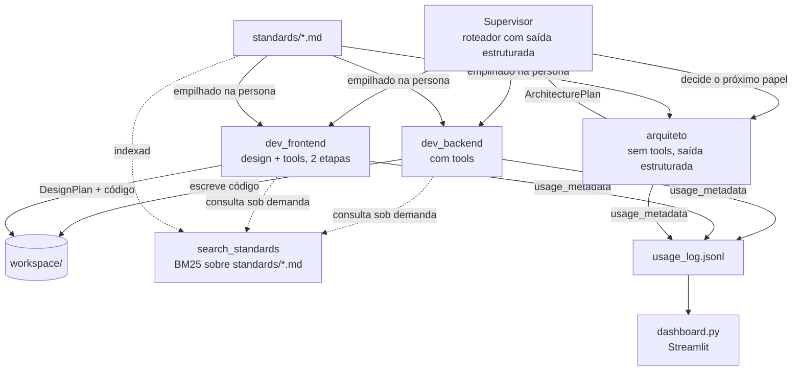

# Arquitetura do dev-agent

> Documento vivo — atualizado a cada decisão estrutural nova. Objetivo:
> qualquer pessoa (ou sessão futura) entender não só *o que* o projeto faz,
> mas *por que* foi construído assim, sem precisar reconstruir o raciocínio
> do zero. Ver [PROGRESS.md](PROGRESS.md) para o estado tarefa-a-tarefa;
> este arquivo é sobre decisões estruturais, não status.

---

## Visão geral

O `dev-agent` é um time de agentes de IA (LangChain + Claude) que projeta
e implementa projetos de software (Python + Next.js) de ponta a ponta.
Cada papel do time é um agente especializado; um Supervisor decide qual
papel age em cada rodada, sem intervenção manual.

## Diagrama do time

## Componentes

| Arquivo | Responsabilidade |
|---|---|
| `agents/llm.py` | Fábrica única do `ChatAnthropic` — modelo, `max_tokens`, header de workspace |
| `agents/team.py` | Personas (`ROLES`), composição de persona + padrões (`_build_persona`), fábricas de agente (`create_agent`, `create_agent_with_tools`), orquestração de duas etapas do frontend (`run_frontend_task`) |
| `agents/supervisor.py` | Roteador (`Decision`, saída estruturada) + loop que aciona cada papel e monta o histórico |
| `agents/schemas.py` | Todo modelo Pydantic compartilhado: `Decision`, `ArchitecturePlan`, `DesignPlan`, `UsageEntry` |
| `agents/tools.py` | Tools sandboxed em `workspace/` — o produto que o time constrói |
| `agents/project_tools.py` | Tools sandboxed na raiz do projeto real, com bloqueio de segredos/git/venv — auto-manutenção do time |
| `agents/knowledge.py` | Índice BM25 sobre `standards/*.md` + tool `search_standards` |
| `agents/usage.py` | Callback que grava cada chamada real ao modelo em `usage_log.jsonl` |
| `standards/*.md` | Convenções de código/design que cada papel segue — arquivos editáveis sem tocar em Python |
| `dashboard.py` | Streamlit lendo `usage_log.jsonl` |
| `main.py`, `dev_backend_agent.py`, `dev_frontend_agent.py`, `team_supervisor.py`, `refactor_team.py` | Scripts de entrada, cada um exercitando uma camada (Passos 1-4 + auditoria) |

---

## Decisões e motivos

### Fundação

**LangChain + Claude (`ChatAnthropic`), não a API bruta da Anthropic direto.**
LangChain dá abstrações prontas (prompt templates, tool calling, saída
estruturada, callbacks) que teríamos que reimplementar na mão — o custo é
uma camada de indireção a mais, aceitável pelo ganho de velocidade.

**`max_tokens` sempre explícito em `build_chat_model`.** Bug real
encontrado cedo: sem isso, uma resposta com "thinking" + várias tool
calls na mesma chamada é cortada no meio do JSON de uma tool call, e a
tool recebe argumento incompleto.

**Papéis como dict de string (persona) + arquivos `.md`, não classes
Python por papel.** Um papel novo é uma entrada de dict + um `.md`
opcional — não precisa de uma classe/arquivo Python novo. O "quem esse
agente é" (persona) fica separado do "que convenções ele segue"
(`standards/*.md`), a mesma ideia de um `CLAUDE.md`.

### Segurança

**Duas sandboxes de tool separadas, nunca uma tool com acesso irrestrito
ao disco.** `agents/tools.py` só enxerga `workspace/` (o produto gerado);
`agents/project_tools.py` só enxerga a raiz do projeto real, com
bloqueio explícito de `.env`/`.git`/`.venv`/`workspace` — usado só pra
auto-manutenção pontual (`refactor_team.py`), nunca pelo time em operação
normal.

**Checkpoint git antes de qualquer sessão que dê a um agente acesso de
escrita ao código real.** Um agente reescrevendo o próprio código-fonte
que o executa é uma classe de risco diferente de escrever num sandbox
descartável — `git diff`/`git checkout -- .` como rede de segurança.

### Padrões e qualidade

**Padrões extraídos de repositórios reais em produção, não de opinião
genérica de internet.** `standards/backend.md` foi destilado de dois
backends FastAPI reais (um processa pagamento via Pix); `standards/frontend.md`,
de dois frontends Next.js reais. Regra prática: auditar a stack de
verdade (`package.json`, config real) ANTES de escrever o `.md` — já
aconteceu de montar um padrão rico demais em cima da stack errada
(auditoria de frontend revelou Next.js onde a gente tinha Vite; a stack
do time foi trocada pra bater com a realidade).

**Saída estruturada (Pydantic) sempre que o resultado alimenta outra
etapa do sistema, não só um humano lendo texto.** `Decision` (o
Supervisor decide o próximo papel), `ArchitecturePlan` (o arquiteto
decide antes de codar), `DesignPlan` (o frontend decide design antes de
codar). Texto livre truncado em 500 caracteres era frágil — um campo
Pydantic é um contrato, não uma esperança de que o modelo formatou certo.

**Design decidido ANTES do código, formalizado como uma etapa separada
(`run_frontend_task`), não só uma instrução na persona.** Recomendação da
skill `artifact-design`: sem isso, cada componente decide cor/fonte na
hora, de forma inconsistente. A etapa de planejamento roda sem tools
(não pode "trapacear" escrevendo código antes de decidir); a etapa de
implementação recebe o plano já pronto via `DesignPlan.to_brief()`.

**Identificadores de código em inglês, docstrings/comentários/logs em
português.** Regra em `standards/general.md`, aplicada em toda
refatoração — inclusive nos nomes de diretório (`agents/`, `standards/`;
`workspace/` já era inglês, não mudou).

### Dados e observabilidade

**Callback de uso próprio, não `get_openai_callback`.** Esse helper do
`langchain_community` só entende o formato de resposta da OpenAI — nem
funcionaria com `ChatAnthropic`, e `langchain_community` nem é
dependência do projeto. Usamos o `usage_metadata` nativo do
`langchain_anthropic`, com um `BaseCallbackHandler` próprio
(`agents/usage.py`) que também não depende de nenhuma classe de Memory
deprecada.

**`UsageEntry` (Pydantic) valida o log tanto na escrita quanto na
leitura.** Uma linha malformada em `usage_log.jsonl` (log antigo, edição
manual) é ignorada com aviso — não derruba o dashboard inteiro parseando
um dict solto.

**Dashboard lê o arquivo, não mantém estado próprio.** `usage_log.jsonl`
é a fonte de verdade; `dashboard.py` só lê e agrega. Atualizar a página
é manual por enquanto (ver PROGRESS.md — não há necessidade real de
tempo real ainda).

### RAG e recuperação de conhecimento

**BM25 (busca por palavra-chave), não embeddings semânticos, pra
`search_standards`.** Alternativa descartada: `HuggingFaceEmbeddings`
(sentence-transformers) + vectorstore — exigiria baixar um modelo de
~100-800MB (com PyTorch) e não traria ganho real pro nosso caso: o
corpus é pequeno (poucos arquivos `.md`) e o vocabulário é técnico e
específico ("IDOR", "JWT", "rounded-lg") — exatamente o cenário onde
busca por palavra-chave funciona bem e busca semântica não compensa o
custo. `rank_bm25` é puro Python, sem dependência pesada, sem chamada de
API nenhuma (nem de embeddings). Se o corpus crescer muito ou ficar mais
narrativo/prosa (menos técnico), essa decisão deve ser revisitada.

**Tokenizador por regex, não `.split()` ingênuo.** Bug real: pontuação de
markdown gruda na palavra (`**idor` em vez de `idor`) e a busca erra o
alvo. Corrigido extraindo sequências de letras/dígitos, tratando o resto
como separador.

**`search_standards` é ADITIVO por enquanto — a persona continua
empilhando o `.md` inteiro.** A migração completa (persona enxuta + tool
como única fonte de detalhe) foi adiada de propósito: sem crédito de API
pra testar se o modelo usa a tool o suficiente sem a rede de segurança do
contexto já vindo pronto, trocar agora é arriscado sem conseguir validar.

### Testes e CI

**Nenhum teste chama a API real da Anthropic.** Toda a suíte (33 testes)
usa fakes/stubs/monkeypatch — um chat model falso (`BaseChatModel`
determinístico) pra provar wiring de callback, ou substituição direta de
`create_agent`/`create_agent_with_tools` por stubs quando o que se testa
é orquestração, não a chamada em si. Consequência direta: o CI roda sem
nenhum secret configurado no repo.

**Convenção de nome de teste**: `test_should_{o_que}_when_{causa}` —
descreve comportamento, não implementação. Herdado dos padrões reais de
backend auditados, aplicado ao próprio projeto.

---

## Limitações conhecidas / trade-offs em aberto

- `search_standards` e a persona "cheia" convivem sem necessidade real
  hoje — redundância aceita até haver crédito pra validar uma migração.
- BM25 não generaliza bem pra pergunta em linguagem muito diferente do
  vocabulário do documento (paráfrase forte) — funciona porque nossos
  `.md` usam termos técnicos exatos que o usuário também tende a usar.
- O histórico do Supervisor (`history: list[str]`) cresce sem limite
  dentro de `MAX_ROUNDS` — não é problema no teto atual (6), mas não tem
  trim/resumo se um dia o teto subir.
- Nenhuma parte do sistema foi validada ponta a ponta com os padrões mais
  recentes (backend rigoroso + `ArchitecturePlan` + Next.js +
  `DesignPlan` + `search_standards` juntos) — bloqueado por crédito de
  API, ver PROGRESS.md.
