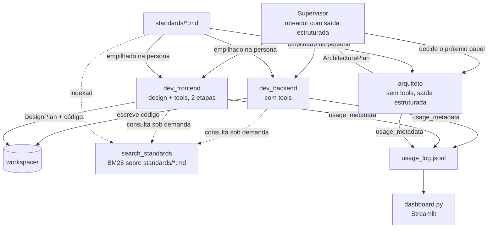

# Arquitetura do dev-agent

> Documento vivo — atualizado a cada decisão estrutural nova. Objetivo:
> qualquer pessoa (ou sessão futura) entender não só *o que* o projeto faz,
> mas *por que* foi construído assim, sem precisar reconstruir o raciocínio
> do zero. Ver [PROGRESS.md](PROGRESS.md) para o estado tarefa-a-tarefa;
> este arquivo é sobre decisões estruturais, não status.

---

## Visão geral

O `dev-agent` é um time de agentes de IA (LangChain + Claude) que projeta
e implementa projetos de software (Python + Next.js) de ponta a ponta.
Cada papel do time é um agente especializado; um Supervisor decide qual
papel age em cada rodada, sem intervenção manual.

## Diagrama do time

## Componentes

| Arquivo | Responsabilidade |
|---|---|
| `agents/llm.py` | Fábrica única do `ChatAnthropic` — modelo, `max_tokens`, header de workspace |
| `agents/team.py` | Personas (`ROLES`), composição de persona + padrões (`_build_persona`), fábricas de agente (`create_agent`, `create_agent_with_tools`), orquestração de duas etapas do frontend (`run_frontend_task`) |
| `agents/supervisor.py` | Roteador (`Decision`, saída estruturada) + loop que aciona cada papel e monta o histórico |
| `agents/schemas.py` | Todo modelo Pydantic compartilhado: `Decision`, `ArchitecturePlan`, `DesignPlan`, `UsageEntry` |
| `agents/tools.py` | Tools sandboxed em `workspace/` — o produto que o time constrói |
| `agents/project_tools.py` | Tools sandboxed na raiz do projeto real, com bloqueio de segredos/git/venv — auto-manutenção do time |
| `agents/knowledge.py` | Índice BM25 sobre `standards/*.md` + tool `search_standards` |
| `agents/usage.py` | Callback que grava cada chamada real ao modelo em `usage_log.jsonl` |
| `standards/*.md` | Convenções de código/design que cada papel segue — arquivos editáveis sem tocar em Python |
| `dashboard.py` | Streamlit lendo `usage_log.jsonl` |
| `main.py`, `dev_backend_agent.py`, `dev_frontend_agent.py`, `team_supervisor.py`, `refactor_team.py` | Scripts de entrada, cada um exercitando uma camada (Passos 1-4 + auditoria) |

---

## Decisões e motivos

### Fundação

**LangChain + Claude (`ChatAnthropic`), não a API bruta da Anthropic direto.**
LangChain dá abstrações prontas (prompt templates, tool calling, saída
estruturada, callbacks) que teríamos que reimplementar na mão — o custo é
uma camada de indireção a mais, aceitável pelo ganho de velocidade.

**`max_tokens` sempre explícito em `build_chat_model`.** Bug real
encontrado cedo: sem isso, uma resposta com "thinking" + várias tool
calls na mesma chamada é cortada no meio do JSON de uma tool call, e a
tool recebe argumento incompleto.

**Papéis como dict de string (persona) + arquivos `.md`, não classes
Python por papel.** Um papel novo é uma entrada de dict + um `.md`
opcional — não precisa de uma classe/arquivo Python novo. O "quem esse
agente é" (persona) fica separado do "que convenções ele segue"
(`standards/*.md`), a mesma ideia de um `CLAUDE.md`.

### Segurança

**Duas sandboxes de tool separadas, nunca uma tool com acesso irrestrito
ao disco.** `agents/tools.py` só enxerga a sandbox de produto (por padrão
`workspace/`, o descartável); `agents/project_tools.py` só enxerga a raiz
do dev-agent, com bloqueio explícito de `.env`/`.git`/`.venv`/`workspace`
— usado só pra auto-manutenção pontual (`refactor_team.py`), nunca pelo
time em operação normal.

**Sandbox de produto configurável via `DEV_AGENT_WORKSPACE`, lida uma
única vez na importação.** O primeiro projeto real do time (`fe-catolica`)
precisava sair de um lugar keepable, com git próprio — não da sandbox
descartável de teste. Em vez de criar um terceiro conjunto de tools,
`agents/tools.py::_resolve_workspace()` lê essa env var (senão cai no
`workspace/` padrão); um script de entrada dedicado
(`build_fe_catolica.py`) define a env var ANTES de importar qualquer
coisa de `agents`. Ler uma única vez, na importação, é proposital: a
sandbox nunca muda no meio de uma execução, mesmo que algo mexa na env
var depois.

**Checkpoint git antes de qualquer sessão que dê a um agente acesso de
escrita ao código real.** Um agente reescrevendo o próprio código-fonte
que o executa é uma classe de risco diferente de escrever num sandbox
descartável — `git diff`/`git checkout -- .` como rede de segurança.

### Padrões e qualidade

**Padrões extraídos de repositórios reais em produção, não de opinião
genérica de internet.** `standards/backend.md` foi destilado de dois
backends FastAPI reais (um processa pagamento via Pix); `standards/frontend.md`,
de dois frontends Next.js reais. Regra prática: auditar a stack de
verdade (`package.json`, config real) ANTES de escrever o `.md` — já
aconteceu de montar um padrão rico demais em cima da stack errada
(auditoria de frontend revelou Next.js onde a gente tinha Vite; a stack
do time foi trocada pra bater com a realidade).

**Saída estruturada (Pydantic) sempre que o resultado alimenta outra
etapa do sistema, não só um humano lendo texto.** `Decision` (o
Supervisor decide o próximo papel), `ArchitecturePlan` (o arquiteto
decide antes de codar), `DesignPlan` (o frontend decide design antes de
codar). Texto livre truncado em 500 caracteres era frágil — um campo
Pydantic é um contrato, não uma esperança de que o modelo formatou certo.

**Design decidido ANTES do código, formalizado como uma etapa separada
(`run_frontend_task`), não só uma instrução na persona.** Recomendação da
skill `artifact-design`: sem isso, cada componente decide cor/fonte na
hora, de forma inconsistente. A etapa de planejamento roda sem tools
(não pode "trapacear" escrevendo código antes de decidir); a etapa de
implementação recebe o plano já pronto via `DesignPlan.to_brief()`.

**Identificadores de código em inglês, docstrings/comentários/logs em
português.** Regra em `standards/general.md`, aplicada em toda
refatoração — inclusive nos nomes de diretório (`agents/`, `standards/`;
`workspace/` já era inglês, não mudou).

### Dados e observabilidade

**Callback de uso próprio, não `get_openai_callback`.** Esse helper do
`langchain_community` só entende o formato de resposta da OpenAI — nem
funcionaria com `ChatAnthropic`, e `langchain_community` nem é
dependência do projeto. Usamos o `usage_metadata` nativo do
`langchain_anthropic`, com um `BaseCallbackHandler` próprio
(`agents/usage.py`) que também não depende de nenhuma classe de Memory
deprecada.

**`cache_read_tokens`/`cache_creation_tokens` no log, não só o total.**
Lacuna encontrada na primeira execução real (`fe-catolica`): tínhamos
implementado prompt caching mas o próprio log não capturava
`usage_metadata["input_token_details"]` (onde o LangChain expõe
`cache_read`/`cache_creation`), então não dava pra confirmar se o cache
estava funcionando — só o total de tokens. Corrigido depois dessa
primeira run (os 71 registros dela ficaram sem esse dado, default 0 por
retrocompatibilidade — `UsageEntry` não quebra lendo log antigo); toda
execução daqui pra frente já mostra a taxa de acerto do cache no
dashboard.

**`UsageEntry` (Pydantic) valida o log tanto na escrita quanto na
leitura.** Uma linha malformada em `usage_log.jsonl` (log antigo, edição
manual) é ignorada com aviso — não derruba o dashboard inteiro parseando
um dict solto.

**Dashboard lê o arquivo, não mantém estado próprio.** `usage_log.jsonl`
é a fonte de verdade; `dashboard.py` só lê e agrega. Atualizar a página
é manual por enquanto (ver PROGRESS.md — não há necessidade real de
tempo real ainda).

### Custo

**Prompt caching (`cache_control: ephemeral`) na mensagem de sistema de
`create_agent`/`create_agent_with_tools`.** Achado da skill `claude-api
cost-optimize`: a persona (papel + `standards/*.md`) é ~2.1-2.9k tokens
estimados por papel (`dev_backend`/`dev_frontend`), idêntica em toda
chamada, e reenviada INTEIRA a cada iteração do loop de tool calling — o
maior alvo de custo do projeto, e o único free win real que dava pra
aplicar sem crédito de API (o wiring se testa; o ganho de custo em si só
se mede com uso real). Efeito colateral bom: como a persona virou uma
`SystemMessage` construída direto (não mais a tupla `("system", persona)`
do `ChatPromptTemplate`, que a tratava como template f-string), o hack de
escapar chaves literais (`_build_persona` fazia `.replace("{", "{{")`)
deixou de ser necessário e foi removido.

**`max_tokens=16000` no agente com tools** (subiu de 8192, o default de
`build_chat_model`). Não é uma economia — é uma correção de higiene de
output: um loop agentic escrevendo vários arquivos tem mais chance de
estourar um teto baixo no meio de uma tool call (o mesmo tipo de corte
que já causou um bug real, documentado acima) do que uma chamada de
texto/planejamento única. Uma tarefa que falha por truncamento e precisa
ser refeita custa mais que a folga extra no teto.

**Propostas descartadas por enquanto (exigem eval que não temos):**
effort mais baixo no roteador do Supervisor (é uma decisão pequena e
repetida — bom candidato, mas sem forma de medir se a qualidade do
roteamento cai) e usar um modelo mais barato pra tarefas rotineiras do
`dev_backend`/`dev_frontend` (arquitetura de dois modelos). Aplicar
qualquer um dos dois sem conseguir comparar antes/depois seria trocar
qualidade por custo às cegas — a skill de cost-optimize é explícita
sobre isso: tradeoffs só se aplicam com uma forma de medir a queda de
qualidade, e hoje não temos nenhuma.

### RAG e recuperação de conhecimento

**BM25 (busca por palavra-chave), não embeddings semânticos, pra
`search_standards`.** Alternativa descartada: `HuggingFaceEmbeddings`
(sentence-transformers) + vectorstore — exigiria baixar um modelo de
~100-800MB (com PyTorch) e não traria ganho real pro nosso caso: o
corpus é pequeno (poucos arquivos `.md`) e o vocabulário é técnico e
específico ("IDOR", "JWT", "rounded-lg") — exatamente o cenário onde
busca por palavra-chave funciona bem e busca semântica não compensa o
custo. `rank_bm25` é puro Python, sem dependência pesada, sem chamada de
API nenhuma (nem de embeddings). Se o corpus crescer muito ou ficar mais
narrativo/prosa (menos técnico), essa decisão deve ser revisitada.

**Tokenizador por regex, não `.split()` ingênuo.** Bug real: pontuação de
markdown gruda na palavra (`**idor` em vez de `idor`) e a busca erra o
alvo. Corrigido extraindo sequências de letras/dígitos, tratando o resto
como separador.

**`search_standards` é ADITIVO por enquanto — a persona continua
empilhando o `.md` inteiro.** A migração completa (persona enxuta + tool
como única fonte de detalhe) foi adiada de propósito: sem crédito de API
pra testar se o modelo usa a tool o suficiente sem a rede de segurança do
contexto já vindo pronto, trocar agora é arriscado sem conseguir validar.

### Testes e CI

**Nenhum teste chama a API real da Anthropic.** Toda a suíte (33 testes)
usa fakes/stubs/monkeypatch — um chat model falso (`BaseChatModel`
determinístico) pra provar wiring de callback, ou substituição direta de
`create_agent`/`create_agent_with_tools` por stubs quando o que se testa
é orquestração, não a chamada em si. Consequência direta: o CI roda sem
nenhum secret configurado no repo.

**Convenção de nome de teste**: `test_should_{o_que}_when_{causa}` —
descreve comportamento, não implementação. Herdado dos padrões reais de
backend auditados, aplicado ao próprio projeto.

---

## Limitações conhecidas / trade-offs em aberto

### O time não conseguia se auto-validar (encontrado no build do fe-catolica)

Depois do primeiro build real, uma revisão manual (Claude Code, sem API)
achou um bug de tipo genuíno (`apiGet<T>` com `ZodType<T>` quebrando a
inferência com schemas `.default()`) e uma dependência com 3 CVEs
críticas (`next@14.2.5`) — nenhum dos dois pego pelo `dev_frontend`
sozinho.

**Causa raiz**: a tarefa proibia "comandos de instalação", regra
copiada sem revisão dos scripts de TESTE rápido (onde faz sentido manter
o loop curto) pros scripts de build REAL. Sem `npm install`, o
`dev_frontend` nunca teve `node_modules` pra rodar `tsc`/`eslint`/
`vitest`/`build` sobre o próprio trabalho — o equivalente a proibir o
`dev_backend` de rodar `pytest`. Isso não é o modelo sendo fraco: é a
tarefa não dar a ferramenta pra ele se checar.

**Corrigido:**
- `run_command` tinha timeout de 60s (curto demais pra instalar
  dependência de verdade — um `npm install` real levou ~2min), subiu
  pra 180s.
- **Auto-validação virou regra permanente da persona, não instrução de
  uma tarefa**: `standards/general.md` ganhou uma seção obrigatória
  (instalar → typecheck/lint/teste/build → `pip-audit`/`npm audit` → só
  então "concluído"), com os comandos exatos em `backend.md`/
  `frontend.md`. Colocar isso no `.md` de padrões — não no texto da
  tarefa — significa que vale pra QUALQUER build futuro automaticamente,
  sem precisar lembrar de repetir a instrução. A proibição antiga de
  instalar foi removida dos scripts do fe-catolica (ficaria contraditória
  com o padrão novo).

**Ainda falta** (ver PROGRESS.md pro detalhe): um papel de revisão/QA no
Supervisor. Os repos reais auditados têm isso explícito
(`quality-reviewer`/`qa-engineer`, até "zero achados"); mesmo com
auto-validação, um agente revisando o PRÓPRIO trabalho pega menos erro
que um segundo papel dedicado a isso — é a parte estrutural do problema
que a mudança acima não resolve sozinha.

### Outras

- `search_standards` e a persona "cheia" convivem sem necessidade real
  hoje — redundância aceita até haver disposição pra validar uma migração.
- BM25 não generaliza bem pra pergunta em linguagem muito diferente do
  vocabulário do documento (paráfrase forte) — funciona porque nossos
  `.md` usam termos técnicos exatos que o usuário também tende a usar.
- O histórico do Supervisor (`history: list[str]`) cresce sem limite
  dentro de `MAX_ROUNDS` — não dá pra recuperar de uma queda de rede no
  meio (ver o incidente real do fe-catolica, PROGRESS.md); um resume
  automático precisaria persistir esse histórico em disco a cada rodada.
